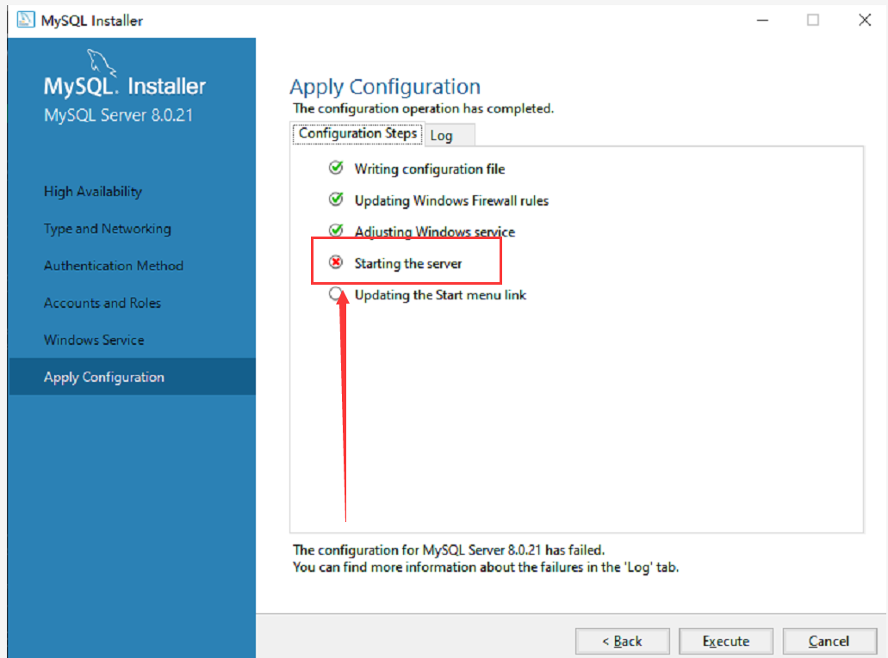
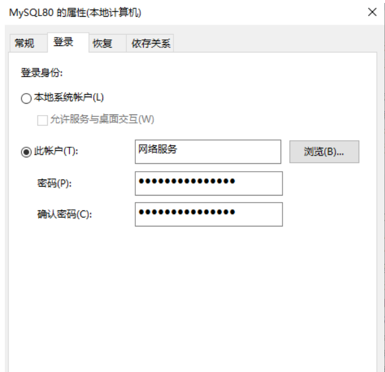
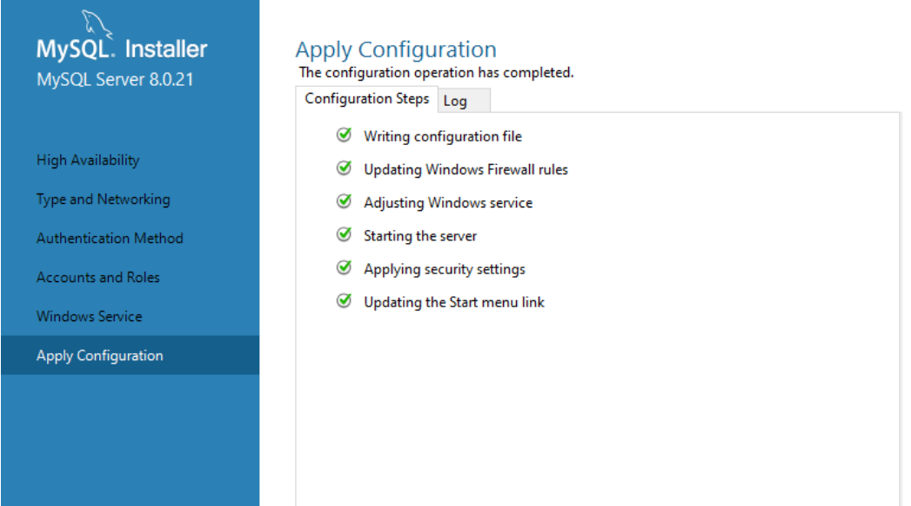

## MySQL安装失败

### 问题

MySQL安装问题：MySQL error 1042: Unable to connect to any of the specified MySQL hosts

### 解决办法

 win+r打开运行，输入services.msc打开服务，找到安装MySQL时添加的服务名，一般8.0版本的MySQL默认是MySQL80，双击打开，登录选项卡下将选择的此账户改为选择本地系统账户。   应用确定之后再执行就没问题了  

